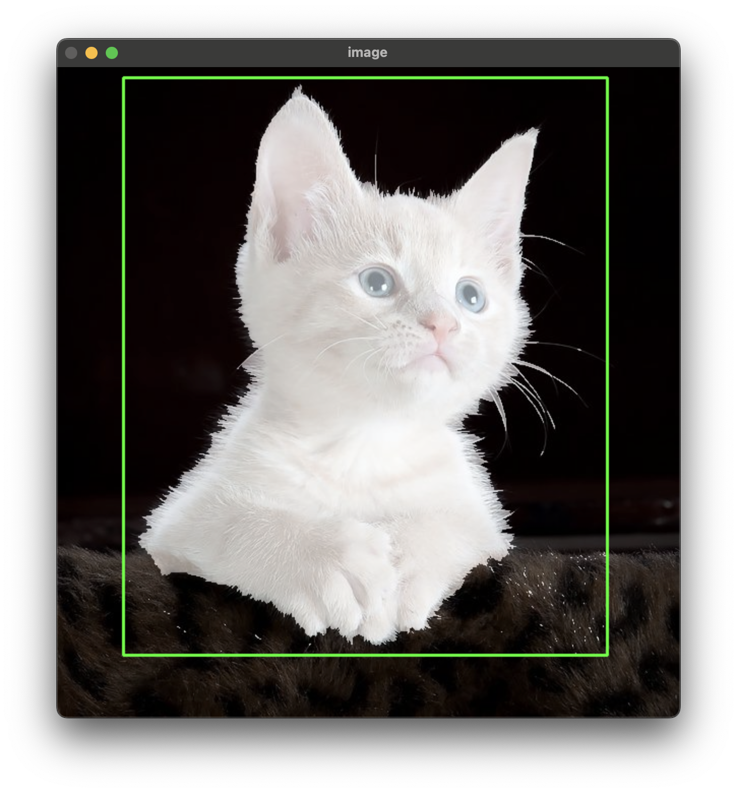

# GrabCut
A C++ implementation of GrabCut Algorithm with OpenCV.

You can just download it and build it with CMake. After build, run the .exe file in your 
cmake-build-debug/cmake-build-release directory.

The GUI function was inherited from grabcut sample from OpenCV.
See it in [this site](https://docs.opencv.org/3.4/d8/d83/tutorial_py_grabcut.html).

Demo:
